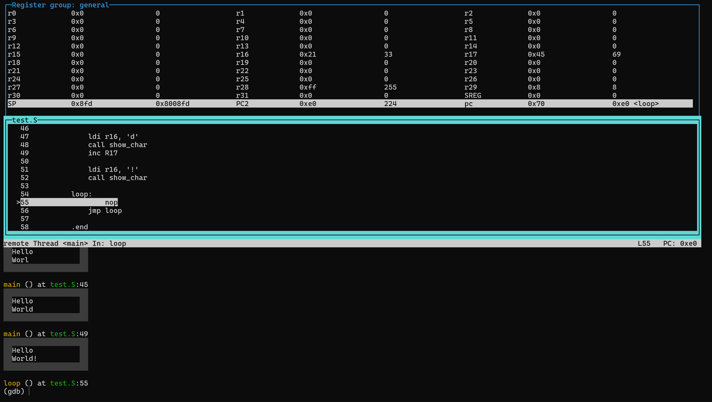

# AVR Assembly Compiler & Debugger

This is a simple Bash script to compile and debug AVR Assembly `.asm` files using `avr-gcc`, `simavr`, and `avr-gdb`. It supports the **ATmega328P** microcontroller and can display the LCD output in the GDB terminal.

---

## 🛠 Requirements

Before using the script, install the necessary tools:

```bash
sudo apt install binutils-avr gcc-avr avr-libc gdb-avr simavr
```

## 💡 Assembly format
Your `.asm` file should follow this format:

```asm
.text
.global main

main:
    ; your AVR assembly code here

loop:
    nop
    jmp loop

.end
```

>You can try and modify the `example.asm` code in this repository.

## 🖥️ LCD Display

>Make sure to include the `printlib.inc` *(keep the version in the repository, as using a different one might cause issues)*.

To display characters on an LCD screen, first call the `init_disp` function to initialize the display. Then, you can use the `show_char` function to display a character at a specified position. The character is passed in `R16`, and the position is determined by `R17`.


```asm
.text
.global main
.include "printlib.inc"

main:
    call init_disp
    ldi r16, 'A'
    ldi r17, 0
    call show_char

loop:
    nop
    jmp loop

.end
```

The LCD display has two lines, with the first line displaying characters at positions `0x00` to `0x0F` and the second line at positions `0x40` to `0x4F`.

## 🚀 Usage

Go to your terminal and type:

`./run_avr.sh <your_file.asm>`

> Make sure, you have execution permissions. If not, add them by `chmod u+x run_avr.sh`.

The script checks for the `.asm` extension, changes extention to `.S`, compiles it to an `.elf` binary, and starts **simavr** on `localhost:1234`.

Then it launches **avr-gdb** with a TUI interface for debugging. Additionally, it runs the `lcd_display.gdb` script which shows the LCD output in the GDB terminal.

> Compilation errors will **abort** the script.

>Temporary `.S` and `.elf` files are automatically deleted when you exit the debugger.

## 📸 Screenshot



## 📜 License
No license. Use and modify freely. Credit and pull requests are appreciated.

## ❓ FAQ
1. **Why do I need to import `printlib.inc` when it only contains a `ret` instruction?**  
   It's required to ensure compatibility with the MPLAB library used in the **BI-SAP** course. Additionally, it serves as a "hook" for GDB, allowing you to set breakpoints and monitor the display output.

2. **Why does the program stop at `show_char` when I use `continue`?**  
   This is because a breakpoint is set in GDB at `show_char` to print the LCD display at the correct moment.

3. **Why is the `printlib` so limited? And why isn’t there a separate function for saving and displaying characters on the LCD?**  
   The `printlib` is designed to have the same interface as the one used in MPLAB for the **BI-SAP** course. This ensures compatibility with their code, which is why it's kept simple and not split into separate functions for saving and displaying characters.

4. **Does the program support buttons?**  
   No, it doesn't support buttons yet. Work is ongoing to add this feature in the future.

5. **Why does the `lcd_display.gdb` script look messy?**  
   AVR-GDB is very limited in functionality, and this is currently the most readable code that can be written given the available features.

6. **Does it work on Windows?**  
   Yes, it works on Windows through **WSL** (Windows Subsystem for Linux).

7. **Why am I getting a "Compilation error" when it works in MPLAB?**  
   This is likely because you skipped the README and didn’t realize that the sections syntax is different. For example, `.org` and other directives are not supported in the same way here. I recommend writing the code in **`example.asm`** where the sections are set up correctly.

8. **Why can’t I run the script?**  
   Make sure the script is up to date with the latest version from the repository and that it has the correct line endings (LF/CRLF).

If you encounter additional errors, please report them in **Issues** or write me on **Discord** (@dzendys_).

>"*MPLAB je sračka."* - Sun Tzu